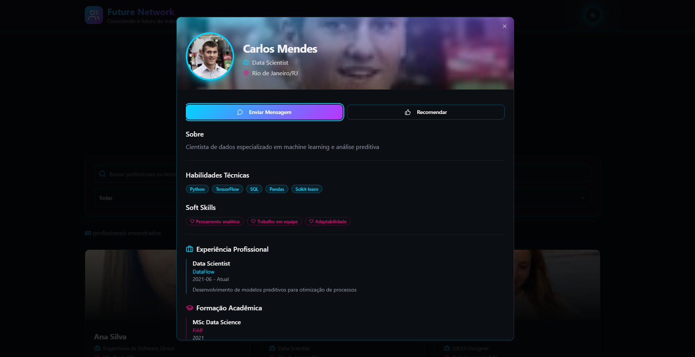

# Future Network

Aplicação web para conectar profissionais e oportunidades, com busca, filtros e cards ricos em detalhes. Interface moderna com tema escuro, gradientes neon e efeitos glass.



## Como Funciona
- Rotas: `App.tsx` usa `react-router-dom` com rotas para `pages/Index.tsx` e `pages/NotFound.tsx`.
- Dados: a lista de profissionais vem do arquivo `src/data/professionals.json`. Cada item possui campos (nome, cargo, localização, habilidades, etc.) e a propriedade `foto` com URL de imagem gratuita (RandomUser).
- UI: componentes base em `src/components/ui` (Shadcn/Radix) e componentes da aplicação em `src/components` (ex.: `ProfessionalCard`, `ProfessionalModal`, `SearchBar`, `ThemeToggle`).
- Estilo: Tailwind CSS configurado via `src/styles/index.css` (tokens HSL, utilitários e camadas base/utilities). `main.tsx` importa `./styles/index.css`.
- Estado/Providers: `App.tsx` habilita `@tanstack/react-query`, `TooltipProvider`, toasts (`ui/toaster` e `ui/sonner`).
- Tema: `ThemeToggle` alterna claro/escuro; variáveis CSS estão em `src/styles/index.css`.

## Requisitos
- Node.js 18+
- npm

## Rodando o Projeto
No PowerShell (Windows):

```powershell
npm install
npm run dev
```

Vite abrirá o servidor local (geralmente em http://localhost:5173). Para build de produção e preview:

```powershell
npm run build
npm run preview
```

Scripts disponíveis:
- `dev`: inicia o servidor de desenvolvimento Vite
- `build`: gera build de produção
- `build:dev`: build com modo development (útil para inspeção)
- `preview`: serve a build gerada localmente
- `lint`: roda ESLint

## Arquitetura
- `index.html`: entrada HTML do Vite.
- `src/main.tsx`: bootstrap do React e import do CSS global.
- `src/App.tsx`: provedores globais, toasts e rotas.
- `src/pages/Index.tsx`: página principal com busca, filtros, grid de profissionais e modal de detalhes.
- `src/pages/NotFound.tsx`: rota coringa 404.
- `src/components`:
	- `ProfessionalCard.tsx`: card do profissional; usa `professional.foto` para a imagem.
	- `ProfessionalModal.tsx`: modal com detalhes, ações (mensagem, recomendar) e seções (experiências, formação, etc.).
	- `SearchBar.tsx`: campo de busca + filtros (área, cidade).
	- `ThemeToggle.tsx` e `NavLink.tsx`: utilidades de layout/navegação/tema.
	- `components/ui/*`: biblioteca de UI (Shadcn + Radix) já estilizada com Tailwind.
- `src/data/professionals.json`: fonte de dados estática com imagens gratuitas do RandomUser em `foto`.
- `src/styles/index.css`: Tailwind (@tailwind base/components/utilities) + tokens de design HSL + utilitários customizados (glass, glow, gradientes, etc.).
- `tailwind.config.ts`, `postcss.config.js`, `vite.config.ts`: configuração do Tailwind, PostCSS e Vite.

## Imagens dos Perfis
- As URLs da propriedade `foto` em `src/data/professionals.json` usam RandomUser (retratos livres para prototipagem), mapeadas por gênero para consistência com os nomes.


## Equipe

- Kaio Victtor Santos Andrade Galvão - rm566536